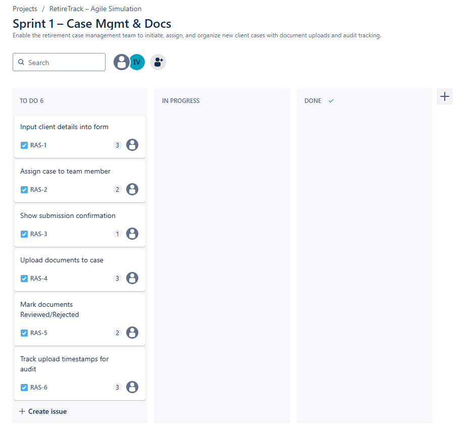

# 🧩 RetireTrack – Agile Case Management Simulation (SAFe Framework)

This is a simulated Agile project designed to demonstrate real-world application of the SAFe Agile framework, aligned with MetLife’s "Business Solutions Consultant" role expectations.

## 🔍 Project Overview

**RetireTrack** is a Case Management Dashboard for MetLife teams to track retirement solution cases. It helps users intake new cases, manage document workflows, monitor progress, generate reports, and ensure audit readiness.

## 🧠 Project Goals

- Simulate a real Agile product lifecycle (SAFe-based)
- Demonstrate Product Owner responsibilities:
  - Writing features and user stories
  - Managing the backlog
  - Leading sprint planning and reviews
  - Tracking Agile metrics
- Showcase ability to support sprint execution and operational readiness
- Build a GitHub portfolio project for resume and interview use

## 📂 Project Structure

- `/backlog/` → Features and user stories (Backlog)
- `/docs/` → Sprint plans, reviews, retrospectives, and metrics
- `/assets/` → Visual diagrams or mockups
- `/tools/` → Screenshots of Agile tools (e.g., Jira, Trello) [optional]

## ✅ Current Progress

| Phase                  | Status                              |
|------------------------|--------------------------------------|
| Project Folder Structure | ✅ Complete                         |
| Product Backlog        | ✅ 5 Features, 15 Stories Added      |
| Sprint 1 Planning      | ✅ Complete                          |
| Sprint 1 Execution     | 🚀 In Progress (RAS-1, RAS-2 started)|
| Sprint 1 Review        | ⬜ Pending                           |
| Sprint 1 Retrospective | ⬜ Pending                           |
| Agile Metrics          | ⬜ Pending                           |
| GitHub Publication     | ✅ Initial Push Complete             |

## 📆 Sprint Progress (High-Level)

| Sprint | Focus                         | Status        |
|--------|-------------------------------|---------------|
| 1      | Case Intake + Docs            | 🚀 In Progress|
| 2      | Status Tracking + Alerts      | ⬜ Not Started|
| 3      | Reporting + Access Control    | ⬜ Not Started|

### 🧩 Sprint 1 Board Snapshot (Start)  

### 🗓️ Sprint Execution – Day 1 Progress
- ✅ RAS-1 moved to In Progress
- ✅ RAS-2 moved to In Progress

## 👤 Created by

**Ioseb Vardoshvili**  
Role Target: *Business Solutions Consultant @ MetLife*  
Framework: *SAFe Agile Simulation*
