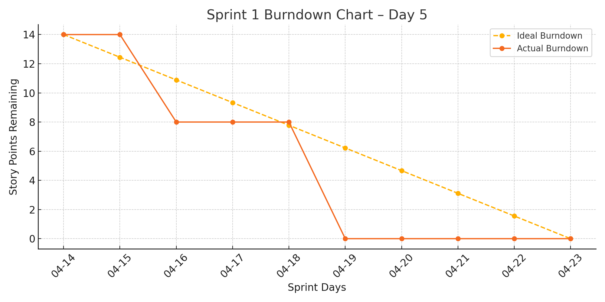
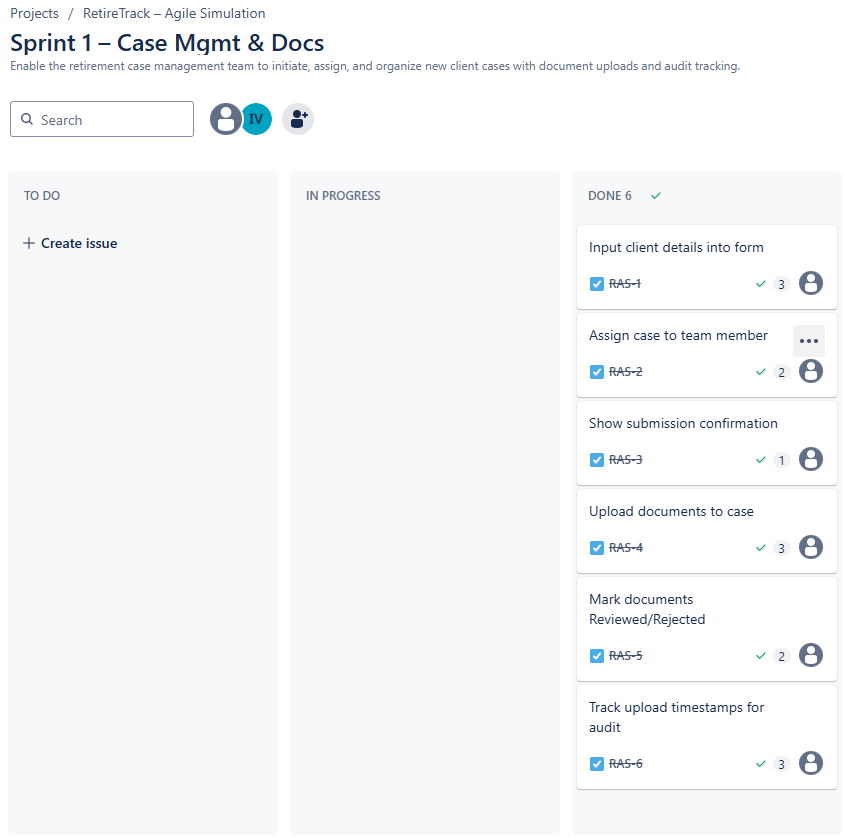

# 🧩 RetireTrack – Agile Case Management Simulation (SAFe Framework)

This is a simulated Agile project designed to demonstrate real-world application of the SAFe Agile framework, aligned with MetLife’s "Business Solutions Consultant" role expectations.

## 🔍 Project Overview

**RetireTrack** is a Case Management Dashboard for MetLife teams to track retirement solution cases. It helps users intake new cases, manage document workflows, monitor progress, generate reports, and ensure audit readiness.

## 🧠 Project Goals

- Simulate a real Agile product lifecycle (SAFe-based)
- Demonstrate Product Owner responsibilities:
  - Writing features and user stories
  - Managing the backlog
  - Leading sprint planning and reviews
  - Tracking Agile metrics
- Demonstrate knowledge of Definition of Done and acceptance criteria in SAFe
- Apply best practices like INVEST, Who-What-Why formatting, and Gherkin-style ACs
- Showcase ability to support sprint execution and operational readiness
- Build a GitHub portfolio project for resume and interview use

## 📂 Project Structure

- `/backlog/` → Features and user stories (Product Backlog)  
  – Includes a sample illustrating our approach to story writing, acceptance criteria, and Definition of Done  
- `/docs/` → Sprint plans, reviews, retrospectives, and metrics  
- `/assets/` → Visual diagrams or mockups  
- `/tools/` → Screenshots of Agile tools (e.g., Jira, Trello) [optional]  
- `/guides/` → Agile practice guides covering feature/story structure, estimation, DoD, compliance, and more

## 📚 Agile Practice Guides

Explore detailed internal guides we created for this simulation, covering:

- [Feature Structure Guide](guides/01_feature_structure_guide.md)
- [User Story Structure Guide](guides/02_user_story_structure_guide.md)
- [Acceptance Criteria Guide](guides/03_acceptance_criteria_guide.md)
- [Definition of Done Checklist](guides/04_definition_of_done_checklist.md)
- [Story Point Estimation Guide](guides/05_story_point_estimation_guide.md)
- [Prioritization Techniques](guides/06_prioritization_techniques.md)
- [Operational Readiness Guide](guides/07_operational_readiness_guide.md)
- [Audit & Compliance in Agile](guides/08_audit_compliance_agile_guide.md)

## ✅ Current Progress

| Phase                  | Status                                           |
|------------------------|--------------------------------------------------|
| Project Folder Structure | ✅ Complete                                     |
| Product Backlog        | ✅ 5 Features, 15 Stories Added                   |
| Sprint 1 Planning      | ✅ Complete                                      |
| Sprint 1 Execution     | ✅ Complete (All stories Done: RAS-1 to RAS-6)   |
| Sprint 1 Review        | ✅ Complete                                      |
| Sprint 1 Retrospective | ✅ Complete                                      |
| Agile Metrics          | ✅ Complete                                      |
| GitHub Publication     | ✅ Initial Push Complete                         |

## 📆 Sprint Progress (High-Level)

| Sprint | Focus                         | Status        |
|--------|-------------------------------|---------------|
| 1      | Case Intake + Docs            | ✅ Completed   |
| 2      | Status Tracking + Alerts      | ⬜ Not Started |
| 3      | Reporting + Access Control    | ⬜ Not Started |

## 📊 Agile Metrics – Sprint 1 Burndown

Visual tracking of Sprint 1 progress using a burndown chart:

### 🧩 Sprint 1 Board Snapshot (Start)  

### 🗓️ Sprint Execution – Day 1 Progress
- ✅ RAS-1 moved to In Progress
- ✅ RAS-2 moved to In Progress

### 🗓️ Sprint Execution – Day 2 Progress
- ✅ RAS-3 moved to In Progress
- ✅ RAS-4 moved to In Progress

### 🗓️ Sprint Execution – Day 3 Progress
- ✅ RAS-1 confirmed and moved to Done
- ✅ RAS-2 confirmed and moved to Done

### 🗓️ Sprint Execution – Day 4 Progress
- ✅ RAS-5 moved to In Progress
- ✅ RAS-6 moved to In Progress
- 🔄 RAS-3 and RAS-4 under refinement and testing

### 🗓️ Sprint Execution – Day 5 Progress
- ✅ RAS-3, RAS-4 confirmed and moved to Done
- ✅ RAS-5, RAS-6 moved to Done after audit validation

## 📈 Value Stream Mapping

See how value flows from intake to delivery in the RetireTrack simulation.  
🛠️ Diagram created using Microsoft Visio to reflect Agile/SAFe team handoffs and flow.

👉 [View Full Value Stream Mapping](docs/value_stream_mapping_retiretrack.md)

📋 [Definition of Done (DoD)](docs/definition_of_done.md) – Clear criteria for when a feature or story is considered complete.

## 👤 Created by

**Ioseb Vardoshvili**  
Role Target: *Business Solutions Consultant @ MetLife*  
Framework: *SAFe Agile Simulation*
