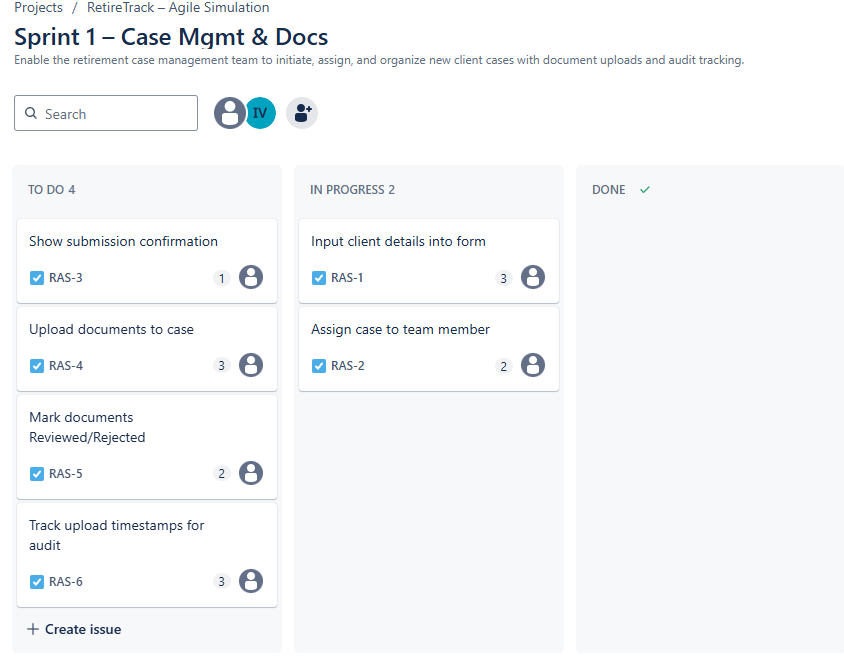
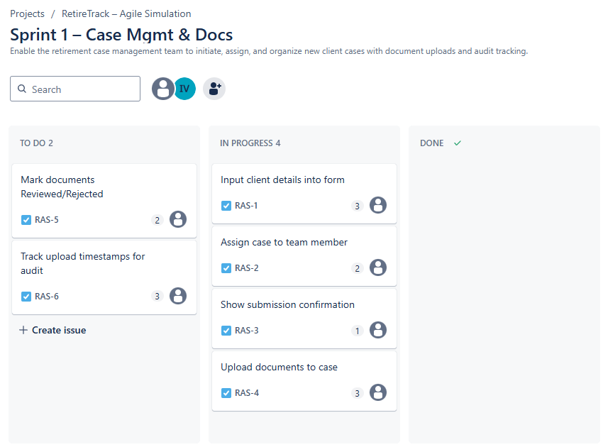
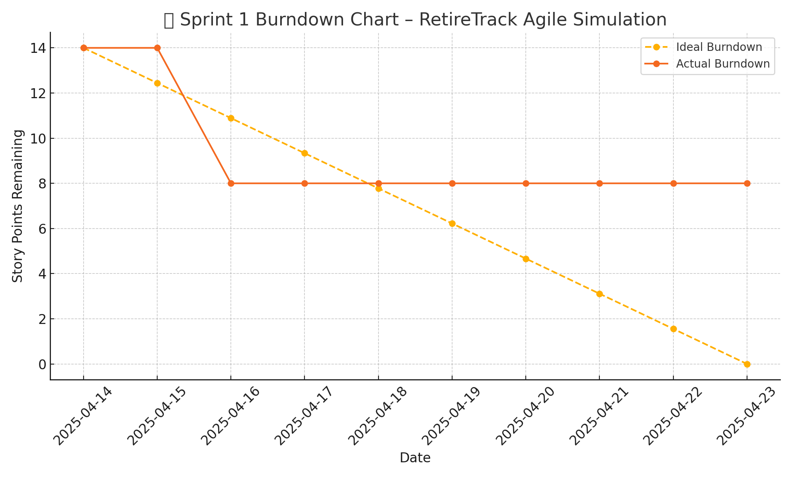
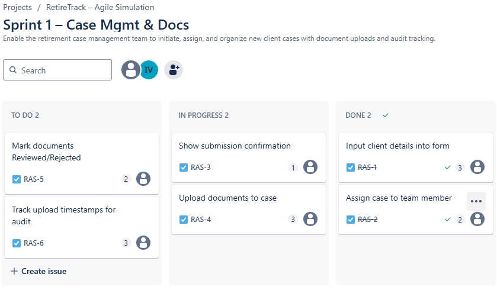
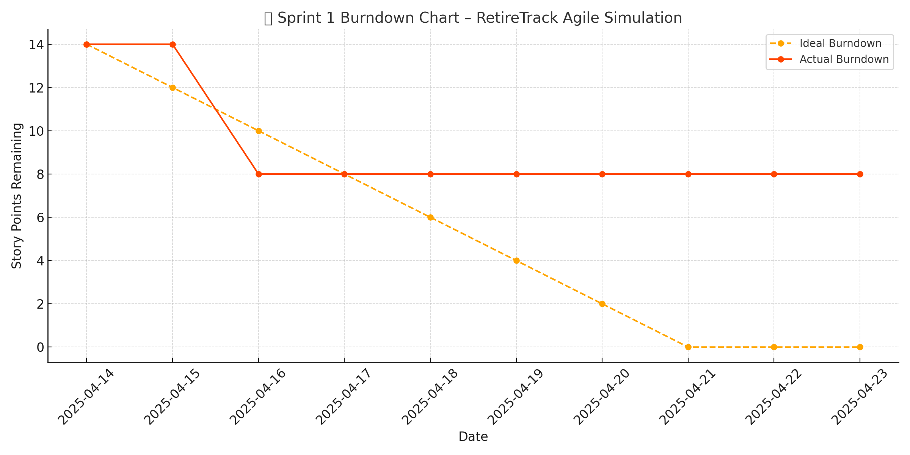

# 📋 Release Plan – RetireTrack Agile Simulation

This document tracks the sprint-by-sprint progress of the **RetireTrack** product, built under a simulated SAFe Agile framework to showcase business solution consulting practices.

---

## 🧩 Sprint 1 – Case Intake & Document Upload

- **Goal:** Enable the team to create, assign, and track client retirement cases with document handling and audit trail features.
- **Duration:** April 14, 2025 – April 28, 2025
- **Status:** 🚀 In Progress

### 🧠 User Stories in Scope:
- `RAS-1` – Input client details into form
- `RAS-2` – Assign case to team member
- `RAS-3` – Show submission confirmation
- `RAS-4` – Upload documents to case
- `RAS-5` – Mark documents Reviewed/Rejected
- `RAS-6` – Track upload timestamps for audit

### 📌 Execution Notes:
- ✅ `RAS-1`, `RAS-2` moved to In Progress (Day 1 – April 14)
- ⏳ Remaining stories scheduled for Day 2/3
- 🔍 Test steps and verification planning will follow

### 📸 Board Snapshot:

### 🗓️ Sprint 1 – Day 2 Progress (April 15)

#### ✅ Execution Notes:
- `RAS-3`, `RAS-4` moved to In Progress (Day 2 – April 15)
- 🧪 Verification checklist will follow on Day 3
- 📥 Testing plan will begin for RAS-1 and RAS-2

#### 📸 Board Snapshot:

#### 📉 Burndown Chart:

🧠 ~~Next step: Confirm RAS-1 and RAS-2 meet acceptance criteria and move to Done on Day 3.~~ ✅ Done

### 🗓️ Sprint 1 – Day 3 Progress (April 16)

#### ✅ Execution Notes:
- `RAS-1`, `RAS-2` confirmed and moved to **Done** after validation
- 🚧 `RAS-5`, `RAS-6` remain in **To Do** (scheduled for Day 4 execution)
- 📤 RAS-4 testing ongoing, documents upload flow under review

#### 📸 Board Snapshot:

#### 📉 Burndown Chart:

🧠 ~~Next step: Add Day 4 chart after next execution update~~ ✅ Done

### 🗓️ Sprint 1 – Day 4 Progress (April 17)

#### ✅ Execution Notes:
- 🟢 `RAS-5`, `RAS-6` moved to **In Progress**
- 🔄 Document review and audit logging flow implementation underway
- 🧪 RAS-3 and RAS-4 remain under validation and refinement

#### 📸 Board Snapshot:

#### 📉 Burndown Chart:
*To be updated on Day 5*

