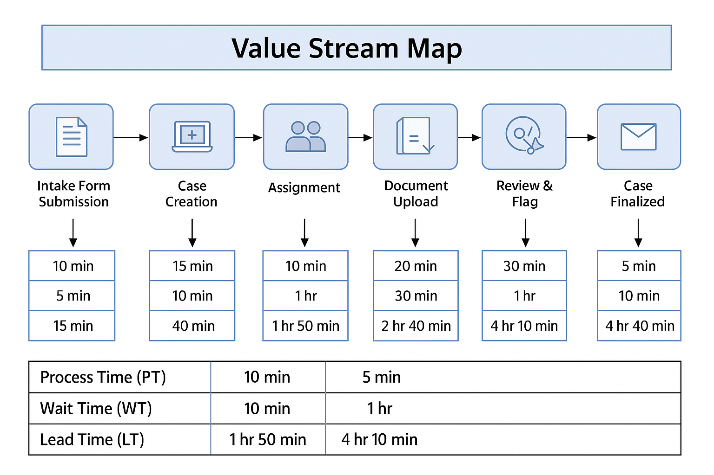

# 📊 Value Stream Mapping – RetireTrack Agile Simulation

This value stream map models the flow from case intake to document upload in the RetireTrack simulation project.  
It visualizes key handoffs, planning cycles, and verification steps aligned with SAFe Agile practices.

